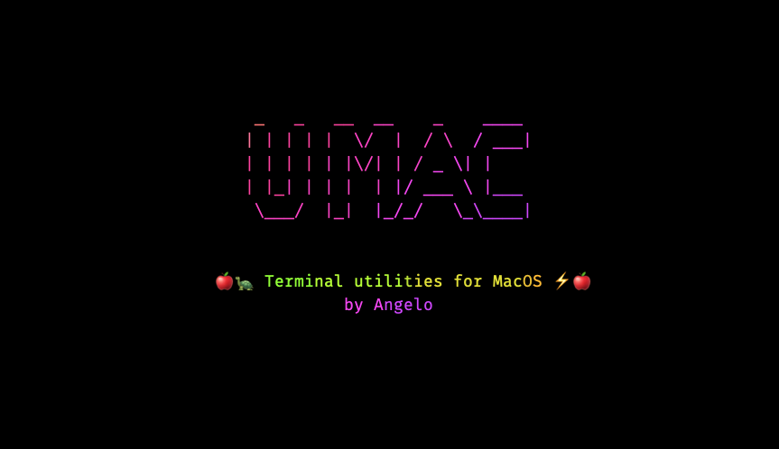
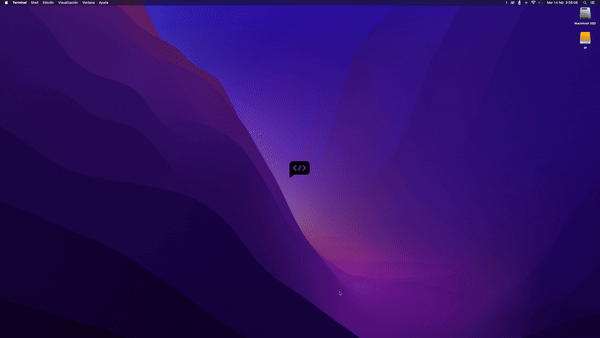

<!--

 █████╗ ███╗   ██╗ ██████╗ ███████╗██╗      ██████╗   
██╔══██╗████╗  ██║██╔════╝ ██╔════╝██║     ██╔═══██╗  
███████║██╔██╗ ██║██║  ███╗█████╗  ██║     ██║   ██║  
██╔══██║██║╚██╗██║██║   ██║██╔══╝  ██║     ██║   ██║  
██║  ██║██║ ╚████║╚██████╔╝███████╗███████╗╚██████╔╝  
╚═╝  ╚═╝╚═╝  ╚═══╝ ╚═════╝ ╚══════╝╚══════╝ ╚═════╝   
                                                                                                                                                              
█████╗█████╗█████╗█████╗█████╗█████╗█████╗█████╗█████╗
╚════╝╚════╝╚════╝╚════╝╚════╝╚════╝╚════╝╚════╝╚════╝                                                                                                                                                     
██╗   ██╗      ███╗   ███╗ █████╗  ██████╗            
██║   ██║      ████╗ ████║██╔══██╗██╔════╝            
██║   ██║█████╗██╔████╔██║███████║██║                 
██║   ██║╚════╝██║╚██╔╝██║██╔══██║██║                 
╚██████╔╝      ██║ ╚═╝ ██║██║  ██║╚██████╗            
 ╚═════╝       ╚═╝     ╚═╝╚═╝  ╚═╝ ╚═════╝            
                                                  

CREATED BY ANGELO 🐦

-->


# 🍎🐢 Terminal utilities for MacOS ⚡️🍎

### What can we do with this tool?
Install apps, force close apps, clear cache, change terminal shell, add notifications, add workflows etc.



<details >
<summary><h3>Index</h3></summary>

- [Prerequesites](#-Prerequesites)
- [Install](#-Install)
- [Usage](#-Usage)
	+ [Apps](#apps)
		* [Install](#Install)
		* [Uninstall](#Uninstall)
		* [Search](#Search)
		* [Dev](#dev)
		* [Close](#Close)
	+ [Cache](#Cache)
	+ [Open](#Open)
	+ [Desktop pictures](#desktop-pictures)
	+ [Notification](#Notification)
	+ [Terminal](#apps)
	+ [Spotlight](#Spotlight)
	+ [Help](#help)
	+ [Version](#version)
- [Donate](#-Donate)
- [License](#-License)
- [Collaborators](#Prerequesites)

</details>


## 🗝 Prerequesites
 
- Have a system based on Darwin OS, that is, any apple computer. 🍎

## 🔑 Install

Copy this line in your terminal and run it.

```bash
git clone https://github.com/angelespejo/umac.git umac && chmod a+x umac/* && cd umac && ./install.sh 
```

## ⚙️ Usage

With ```umac``` you can do many different things. The idea could be to add more and more, who knows 😎

Here is a list of how to use ```umac```

### Apps

```bash
umac app [option]
```

#### Install

Install apps using HomeBrew. Don't worry if HomeBrew is not installed on your system, in theory umac should do it for you automatically 🔮

```bash
umac app install appName1 appName2

# or 
umac app i appName1 appName2
```

#### Uninstall

Uninstall apps using HomeBrew.

```bash
umac app uninstall appName1 appName2

# or 
umac app u appName1 appName2
```

#### Search

Search apps using HomeBrew.

```bash
umac app search appName

# or 
umac app s appName
```

#### Dev

Change or show status for no identificated apps.

Show status for no identificated apps

```bash
umac app dev

# or 
umac app dev --status
```

Change status for no identificated apps

```bash
umac app dev --enable

# or 
umac app dev -e
```

```bash
umac app dev --disable

# or 
umac app dev -d
```

#### Close

Force close apps from a list

```bash
umac close
```

Force close all apps

```bash
umac close=All
```

Force close specific apps

```bash
umac close=app1,app2
```

### Cache

Remove macOS cache from a list.

```bash
umac cache
```

Remove all macOS cache.

```bash
umac cache=All
```

Remove specific macOS cache.

```bash
umac cache=name1,name2 
```

Open macOS cache directory with Finder.

```bash
umac cache --open 
```

### Open

Open path in Finder.

```bash
umac open your/path/to/open
```

Open path in Safari.

```bash
umac open your/path/to/open --safari 
```

Open path in Firefox.

```bash
umac open your/path/to/open --firefox 
```

Open path in Chrome.

```bash
umac open your/path/to/open --chrome 
```

Open path in Opera.

```bash
umac open your/path/to/open --opera 
```

Open path in Tor Browser.

```bash
umac open your/path/to/open --tor 
```

### Desktop pictures

To add Desktop image in desktop pictures directory.

```bash
umac desk-pics your/image/path
```


To add Desktop images from a directory in desktop pictures directory

```bash
umac desk-pics your/image/path --dir 
```


To add Desktop images from a directory in system desktop pictures directory.

```bash
umac desk-pics your/image/path --sys 
```

### Notification

Set a macOS notification.

```bash
umac notification yourOwnTextString

# or

umac not yourOwnTextString
```

### Terminal

Change shell.

```bash
umac terminal shell change

# or

umac term shell change

# With a value

umac terminal shell change=shellName

# or

term shell change=shellName

```

List available shells.

```bash
umac terminal shell list

# or

umac term shell list

```

View current shell.

```bash
umac terminal shell curr

# or

umac term shell curr

```

### Spotlight

To manage Spotlight.

```bash
umac spotlight

```

To enable Spotlight.

```bash
umac spotlight --enable

```


To disable Spotlight.

```bash
umac spotlight --disable

```

### Help

Set software help.

```bash
umac --help

# or 

umac -h
```


### Version

Set version.

```bash
umac --version

# or 

umac -v
```

## ☕ Donate

Help me to develop more interesting things.

[Donate](https://pigeonposse.com/?popup=donate) 

## 📜 License

The software is licensed with GPL-3 (GNU GENERAL PUBLIC LICENSE Version 3)

[Read more](https://github.com/angelespejo/umac/LICENSE)

### Collaborators

|                                                                                    | Name        | Role         | GitHub                                         |
| ---------------------------------------------------------------------------------- | ----------- | ------------ | ---------------------------------------------- |
|  | AngelEspejo | Author       | [@AngelEspejo](https://github.com/AngelEspejo) |
